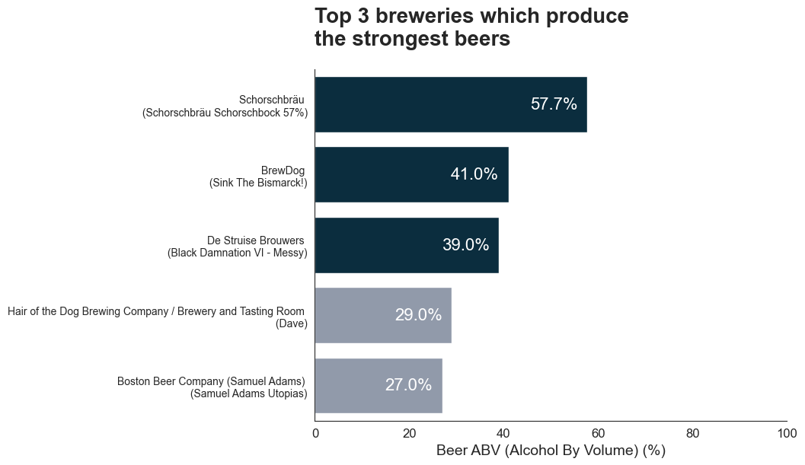
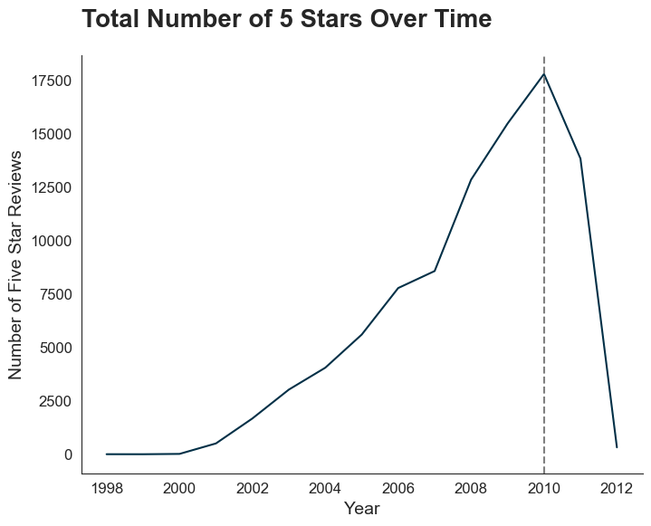

# Beer Data Analysis Report

## Table of Contents

1. Executive Summary
2. Data & Methodology
3. Data Analysis & Results
4. Conclusion
5. Appendix

## 1. Executive Summary

This project conducted a comprehensive analysis of a dataset comprising 1,586,614 customer ratings and 13 different variables for 5,743 beers obtained from Kaggle. The primary objectives were to address several critical questions related to brewery rankings, ratings by year, factors influencing user preferences, and beer recommendations.

**Brewery Rankings:**
The analysis identified the top 3 breweries that produce the strongest beers. These breweries were found to be Schorschbräu, BrewDog, and De Struise Brouwers, based on the data.

**Year of Highest Ratings:**
Through meticulous examination, the year with the highest ratings for beers was identified as 2010, with a total of 17,757 five-star ratings. This insight provides valuable historical context.

**Factors Influencing User Preferences:**
To ascertain the factors influencing user preferences among taste, aroma, appearance, and palate, a linear regression model and visualizations were employed. The findings revealed that customers prioritize taste over other factors, shedding light on the key driver of user satisfaction.

**Beer Recommendations:**
Drawing from the analysis, three beer recommendations were made for sharing with friends. Rauch Ür Bock, Caldera Pale Ale, and Old Growth Imperial Stout, all produced by Caldera Brewing Company, were suggested. These selections were made based on high taste and overall ratings, as well as their relatively low alcohol by volume content, making them appealing choices for various tastes.

The project's thorough data preparation, insightful visualizations, and robust analysis provide valuable insights into the world of beer preferences and brewery rankings. The identified top breweries, peak rating year, and factors influencing user satisfaction contribute to a comprehensive understanding of the dataset. Additionally, the beer recommendations offer practical suggestions for enthusiasts seeking enjoyable options with diverse palates.

## 2. Data & Methodology

### 2.1 About the Data

The data was from [kaggle.com](https://www.kaggle.com/datasets/thedevastator/1-5-million-beer-reviews-from-beer-advocate). The data contains 1.5 million beer reviews from Beer Advocate. It includes ratings on appearance, aroma, palate, taste, and overall impression. Reviews also include product and user information.

The data has the following columns:

* `beer_ABV` - alcohol by volume
* `beer_beerId` - beer ID
* `beer_brewerId` - beer brewer ID
* `beer_name` - beer name
* `beer_style` - beer style
* `review_appearance` - review on the beer's appearance
* `review_palette` - review on the beer's palette (colours)
* `review_overall` - overall beer review
* `review_taste` - review on the beer's taste
* `review_profileName` - profile name of the reviewer
* `review_aroma` - review on the beer's aroma
* `review_time` - timestamp when the review was made

## 2. Data Analysis & Results

